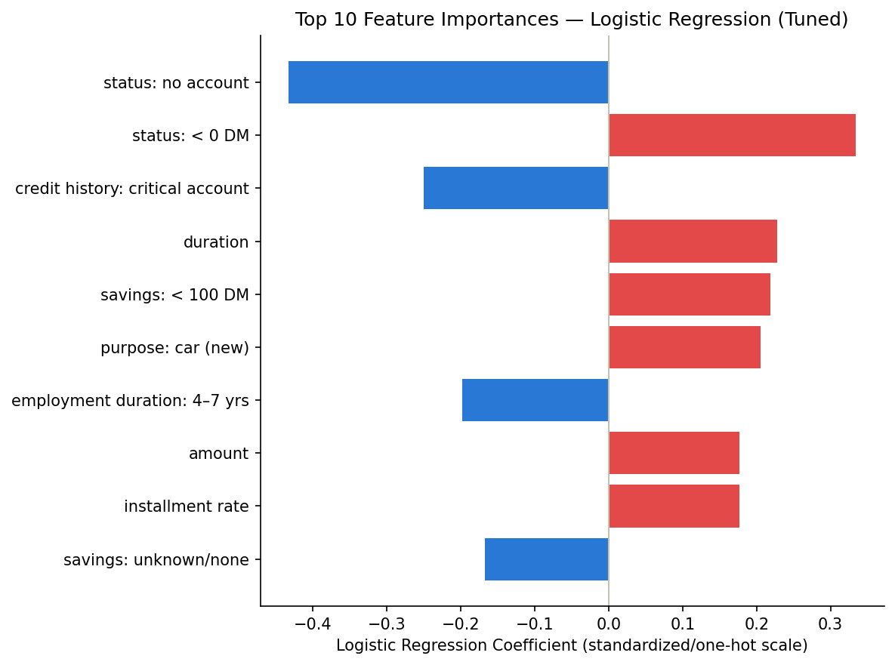

# Credit Risk ML Pipeline

## Final Model

Logistic Regression, tuned via RandomizedSearchCV, trained on SMOTE-balanced
data — business cost 99, AUC-ROC 0.845 (see `notebooks/03_modeling.ipynb` for
the full model comparison and rationale).

## Feature Importance

Top 10 features by absolute Logistic Regression coefficient magnitude
(transformed/standardized scale). Red bars increase predicted default risk;
blue bars decrease it.
